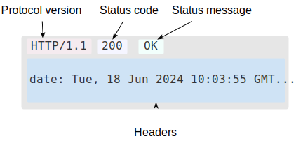

# Task 0: Basics of HTTP and HTTPS

## Difference Between HTTP and HTTPS

| Feature              | HTTP                                 | HTTPS                                   |
|----------------------|--------------------------------------|------------------------------------------|
| Protocol             | Hypertext Transfer Protocol          | Hypertext Transfer Protocol Secure       |
| Port                 | 80                                   | 443                                      |
| Security             | No encryption                        | Encrypted with SSL/TLS                   |
| Data Protection      | Data sent in plaintext               | Data is encrypted (confidential)         |
| URL Format           | `http://example.com`                 | `https://example.com`                    |
| Use Case             | Public blogs, test environments      | Login pages, payment gateways, emails    |

**Summary**:  
HTTP is vulnerable to eavesdropping and man-in-the-middle attacks. HTTPS ensures secure communication by encrypting the data, protecting it from tampering and unauthorized access.

---

## Structure of an HTTP Request and Response

### Example HTTP Request:
```
GET /index.html HTTP/1.1
Host: www.example.com
User-Agent: Mozilla/5.0
Accept: text/html
```


### Example HTTP Response:
```
HTTP/1.1 200 OK
Date: Sun, 16 Jun 2024 12:00:00 GMT
Content-Type: text/html
Content-Length: 1234

<html>
  <body>Hello, world!</body>
</html>
```




**Key Components**:
- **Method**: GET, POST, etc.
- **Path**: `/index.html`
- **Headers**: Metadata (Host, User-Agent, etc.)
- **Status Line**: Protocol version and status code (e.g., 200 OK)
- **Body**: The actual content (HTML, JSON, etc.)

---

## Common HTTP Methods

| Method | Description                        | Example Use Case                            |
|--------|------------------------------------|---------------------------------------------|
| **GET** | Retrieve a resource                 | Fetch user profile from `/api/user/1`       |
| **POST** | Submit data to the server           | Create a new user with `POST /api/users`    |
| **PUT** | Update an existing resource         | Update address at `PUT /api/users/1`        |
| **DELETE** | Delete a resource                 | Remove user with `DELETE /api/users/1`      |

---

## Common HTTP Status Codes

| Status Code | Description            | Scenario Example                                                  |
|-------------|------------------------|-------------------------------------------------------------------|
| **200 OK**  | Request succeeded      | The response to a successful `GET` or `POST`                      |
| **201 Created** | Resource created   | After creating a new user or item with a `POST` request           |
| **400 Bad Request** | Client error   | The request was malformed or missing required fields              |
| **404 Not Found** | Resource missing | Trying to fetch `/api/user/999` when it doesn’t exist             |
| **500 Internal Server Error** | Server failure | Unexpected error occurred on the server during processing         |

---

## Optional Exploration with Browser Tools

You can inspect HTTP traffic using developer tools:

1. Open browser and go to any website (e.g., https://google.com).
2. Right-click → **Inspect** → go to the **Network** tab.
3. Reload the page and click on the first request.
4. Under **Headers**, you’ll see the request and response details.

---

## References
- [MDN Overview of HTTP](https://developer.mozilla.org/en-US/docs/Web/HTTP/Guides/Overview)
- [Cloudflare: Why HTTP is Not Secure](https://www.cloudflare.com/learning/ssl/why-is-http-not-secure/)
- [Wikipedia: HTTP Status Codes](https://en.wikipedia.org/wiki/List_of_HTTP_status_codes)
